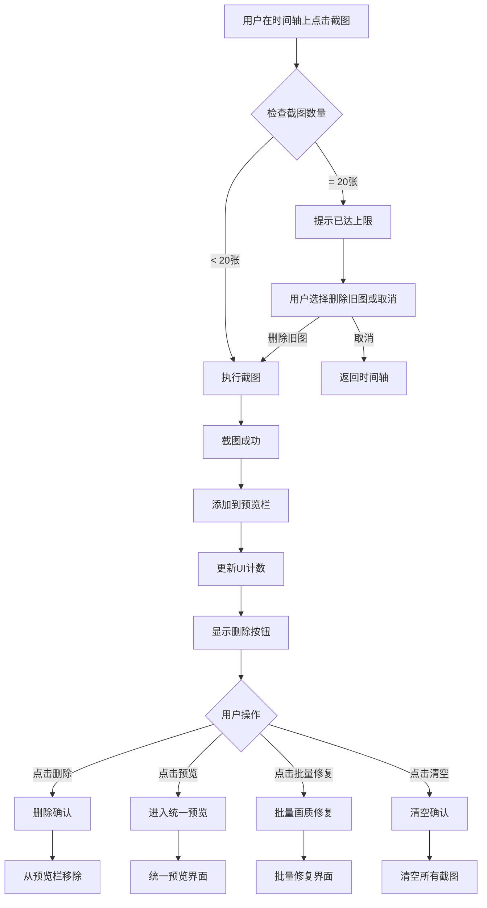
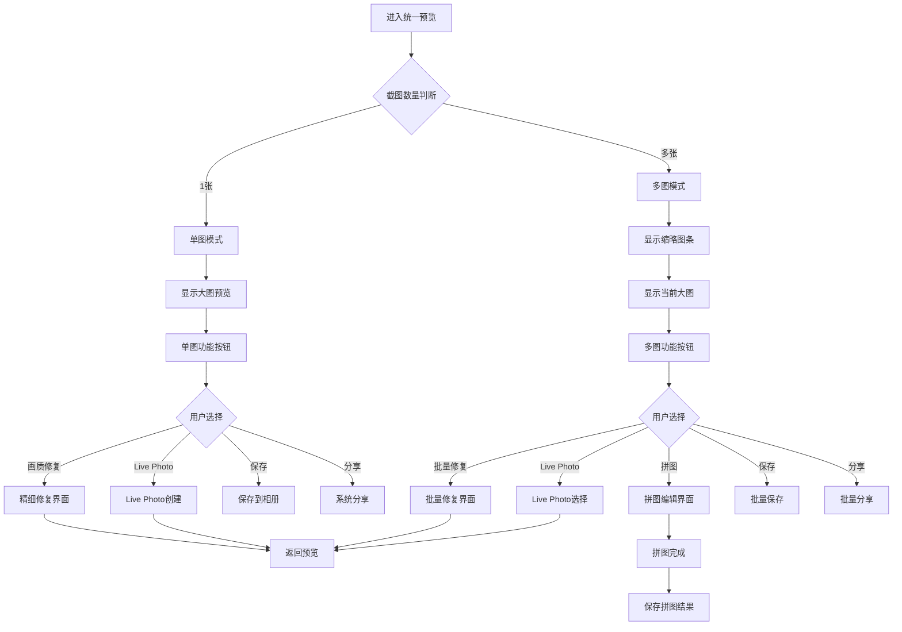
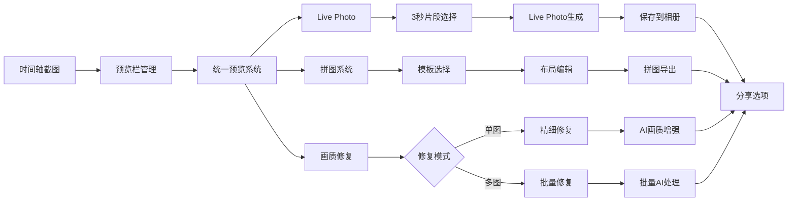

# 多图截取与处理系统设计方案

## 📋 需求分析总结

基于详细需求分析，我们需要实现一个综合性的多图截取与处理系统，包含以下核心功能：

### 🎯 核心需求清单
1. **时间轴多图截取** - 在时间轴上显示截图预览区域，支持删除操作
2. **时间轴Live Photo模式** - 在时间轴直接切换Live Photo模式，基于白色竖线位置(往后3秒)一键生成
3. **会话隔离设计** - 普通截图和Live Photo模式完全隔离，切换时清空当前内容
4. **统一预览系统** - 单图/多图共用预览界面，功能动态适配（同类型内容）
5. **拼图功能集成** - 多图情况下支持跳转到拼图编辑（仅普通截图）
6. **画质修复统一** - 单图精细修复 vs 多图批量处理

---

## 🏗 系统架构设计

### 整体架构图

```
┌─────────────────────────────────────────────────────────────┐
│                    时间轴主界面 (TimelineView)                    │
├─────────────────────────────────────────────────────────────┤
│  视频播放区域                                                 │
│  ┌─────────────────────────────────────────────────────┐     │
│  │              Video Preview                          │     │
│  │                                                     │     │
│  └─────────────────────────────────────────────────────┘     │
│                                                             │
│  白色竖线定位器 + 时间轴滚动区域                                │
│  ┌─────────────────────────────────────────────────────┐     │
│  │         Timeline with White Indicator              │     │
│  └─────────────────────────────────────────────────────┘     │
│                                                             │
│  🎛 模式切换器 (新增组件)                                      │
│  ┌─────────────────────────────────────────────────────┐     │
│  │    ○ 普通截图      ● Live Photo (3秒)               │     │
│  └─────────────────────────────────────────────────────┘     │
│                                                             │
│  📸 多图截取预览区域 (会话隔离设计)                            │
│  ┌─────────────────────────────────────────────────────┐     │
│  │ 普通模式: [🖼X] [🖼X] [🖼X] [🖼X]  [+截图] [预览] [拼图] │     │
│  │ Live模式: [🔴3s] [🔴3s] [🔴3s]   [+截图] [预览] [保存] │     │
│  └─────────────────────────────────────────────────────┘     │
│                                                             │
│  控制按钮区域                                                │
│  ┌─────────────────────────────────────────────────────┐     │
│  │    [播放]  [截图]  [设置]  [相册]                      │     │
│  └─────────────────────────────────────────────────────┘     │
└─────────────────────────────────────────────────────────────┘
                              │
                              ▼
┌─────────────────────────────────────────────────────────────┐
│               统一预览系统 (UnifiedPreviewSystem)               │
├─────────────────────────────────────────────────────────────┤
│  动态模式切换：                                               │
│  ┌─────────────────┐  ┌─────────────────────────────────┐   │
│  │   单图模式       │  │        多图模式                 │   │
│  │  ┌───────────┐   │  │  ┌─┐┌─┐┌─┐                   │   │
│  │  │  大图预览  │   │  │  │1││2││3│ ← 横向滚动           │   │
│  │  │           │   │  │  └─┘└─┘└─┘                   │   │
│  │  │           │   │  │  ┌─────────────────────────┐   │   │
│  │  └───────────┘   │  │  │     当前选中大图预览      │   │   │
│  │                 │  │  └─────────────────────────┘   │   │
│  └─────────────────┘  └─────────────────────────────────┘   │
│                                                             │
│  🛠 动态功能按钮区域                                          │
│  ┌─────────────────────────────────────────────────────┐     │
│  │ 单图模式: [画质修复] [Live Photo] [保存] [分享]          │     │
│  │ 多图模式: [批量修复] [Live Photo] [拼图] [保存] [分享]    │     │
│  └─────────────────────────────────────────────────────┘     │
└─────────────────────────────────────────────────────────────┘
                              │
                ┌─────────────┼─────────────┐
                ▼             ▼             ▼
┌─────────────────┐ ┌─────────────────┐ ┌─────────────────┐
│   画质修复系统    │ │  Live Photo     │ │    拼图系统      │
│                │ │    创建系统       │ │                │
│ ┌─────────────┐ │ │ ┌─────────────┐ │ │ ┌─────────────┐ │
│ │单图精细修复 │ │ │ │3秒片段选择  │ │ │ │多模板布局   │ │
│ │多图批量处理 │ │ │ │封面帧生成   │ │ │ │智能排版     │ │
│ └─────────────┘ │ │ │Live Photo   │ │ │ │创意编辑     │ │
│                │ │ │  组装导出     │ │ │ └─────────────┘ │
└─────────────────┘ │ └─────────────┘ │ └─────────────────┘
                   └─────────────────┘
```

### 核心组件架构

```swift
// 🏗 系统架构核心组件
class MultiScreenshotSystem {
    // 截图管理器
    var screenshotManager: ScreenshotManager
    
    // 统一预览系统
    var unifiedPreviewSystem: UnifiedPreviewSystem
    
    // 功能扩展系统
    var livePhotoCreator: LivePhotoCreator
    var collageSystem: CollageSystem
    var enhancementSystem: EnhancementSystem
}

// 📸 截图管理器
class ScreenshotManager {
    var screenshots: [ScreenshotItem] = []
    var maxScreenshots: Int = 20  // 最大截图数量限制
    
    func addScreenshot(_ screenshot: ScreenshotItem)
    func removeScreenshot(at index: Int)
    func clearAllScreenshots()
    func getScreenshotCount() -> Int
}

// 🔄 统一预览系统 (会话隔离设计)
class UnifiedPreviewSystem {
    enum PreviewMode {
        case single(ScreenshotItem)
        case multiple([ScreenshotItem], currentIndex: Int)
    }
    
    enum CaptureMode {
        case stillImage     // 普通截图模式
        case livePhoto      // Live Photo模式
    }
    
    var currentMode: PreviewMode
    var captureMode: CaptureMode
    var availableActions: [PreviewAction]
    
    func switchMode(to mode: PreviewMode)
    func switchCaptureMode(to mode: CaptureMode)
    func updateAvailableActions()
}

// 🎛 预览动作类型
enum PreviewAction {
    case save                    // 保存
    case enhance                 // 画质修复
    case createLivePhoto         // 创建Live Photo
    case createCollage           // 创建拼图
    case share                   // 分享
    case delete                  // 删除
}
```

---

## 🎨 UI布局详细设计

### 1. 时间轴界面升级

```
┌─────────────────────────────────────────────────────────────┐
│                    TimelineView (升级版)                      │
├─────────────────────────────────────────────────────────────┤
│  📹 视频预览区域 (保持现有设计)                                │
│  ┌─────────────────────────────────────────────────────┐     │
│  │                                                     │     │
│  │              Video Preview                          │     │
│  │                                                     │     │
│  └─────────────────────────────────────────────────────┘     │
│                                                             │
│  ⏱ 时间轴区域 (优化布局设计)                                   │
│  ┌─────────────────────────────────────────────────────┐     │
│  │  缩略图条  │████████████████│                       │     │
│  │           │       ║                                │     │
│  │  时间刻度  │░░░░░░░░░░░░░░│░░░│                       │     │
│  │  播放轨道  │▓▓▓▓▓▓▓▓▓▓▓▓▓▓▓▓│                       │     │
│  │           │   白色竖线定位器                          │     │
│  └─────────────────────────────────────────────────────┘     │
│                                                             │
│  🎛 新增：模式切换器 (高度: 40px)                              │
│  ┌─────────────────────────────────────────────────────┐     │
│  │    ○ 普通截图      ● Live Photo (3秒)               │     │
│  │    ↑ 点击切换模式                                    │     │
│  └─────────────────────────────────────────────────────┘     │
│                                                             │
│  ⏱ 时间轴区域 (动态范围指示 - 优化布局)                         │
│  ┌─────────────────────────────────────────────────────┐     │
│  │  普通模式:                                           │     │
│  │  缩略图条  │████████████████│                       │     │
│  │           │       ║                                │     │
│  │  时间刻度  │░░░░░░░░░░░░░░║░░░│                       │     │
│  │  播放轨道  │▓▓▓▓▓▓▓▓▓▓▓▓▓▓▓▓│  (白色竖线定位)          │     │
│  │                                                     │     │
│  │  Live模式:                                          │     │
│  │  缩略图条  │████████████████│                       │     │
│  │           │       ║                                │     │
│  │  时间刻度  │░░░░░░░░░░░░░░║▓▓▓│ ← 3秒范围高亮         │     │
│  │  播放轨道  │▓▓▓▓▓▓▓▓▓▓▓▓▓▓▓▓│  (当前位置→往后3秒)      │     │
│  └─────────────────────────────────────────────────────┘     │
│                                                             │
│  📸 新增：多图截取预览区域 (会话隔离设计，高度: 80px)             │
│  ┌─────────────────────────────────────────────────────┐     │
│  │ 普通截图模式: 💡已截4张图片 (最多20张)      🗑清空     │     │
│  │ ┌──┐ ┌──┐ ┌──┐ ┌──┐             ┌──┐ ┌──┐ ┌──┐      │     │
│  │ │🖼│ │🖼│ │🖼│ │🖼│  ......     │📷│ │👁│ │✨│      │     │
│  │ │ X│ │ X│ │ X│ │ X│             │截│ │预│ │修│      │     │
│  │ └──┘ └──┘ └──┘ └──┘             │图│ │览│ │复│      │     │
│  │  01s  03s  05s  08s             └──┘ └──┘ └──┘      │     │
│  │                                                     │     │
│  │ Live Photo模式: 💡已截2个Live Photo (最多20个) 🗑清空 │     │
│  │ ┌──┐ ┌──┐                      ┌──┐ ┌──┐ ┌──┐      │     │
│  │ │🔴│ │🔴│           ......     │📷│ │👁│ │💾│      │     │
│  │ │3s│ │3s│                      │截│ │预│ │存│      │     │
│  │ └──┘ └──┘                      │图│ │览│ │档│      │     │
│  │  01s  04s                      └──┘ └──┘ └──┘      │     │
│  └─────────────────────────────────────────────────────┘     │
│  ↑ 根据当前模式显示对应类型内容，切换模式时清空预览栏           │
└─────────────────────────────────────────────────────────────┘
```

### 2. 多图截取预览区域详细设计

```swift
class ScreenshotPreviewBar: UIView {
    // UI组件
    private let scrollView = UIScrollView()              // 横向滚动容器
    private let stackView = UIStackView()                // 截图堆叠视图
    private let hintLabel = UILabel()                    // 提示标签
    private let actionButtonsStack = UIStackView()       // 操作按钮组
    
    // 操作按钮
    private let captureButton = UIButton()               // 截图按钮
    private let previewButton = UIButton()               // 预览按钮
    private let enhanceButton = UIButton()               // 批量修复按钮
    private let clearButton = UIButton()                 // 清空按钮
    
    // 数据
    private var screenshots: [ScreenshotItem] = []
    private let maxScreenshots = 20
    
    // 回调
    var onScreenshotTap: ((ScreenshotItem, Int) -> Void)?
    var onPreviewAllTap: (() -> Void)?
    var onEnhanceAllTap: (() -> Void)?
    var onClearAllTap: (() -> Void)?
}

// 单个截图缩略图组件
class ScreenshotThumbnailView: UIView {
    private let imageView = UIImageView()
    private let deleteButton = UIButton()
    private let timestampLabel = UILabel()
    
    var onDeleteTap: (() -> Void)?
    
    func configure(with screenshot: ScreenshotItem) {
        imageView.image = screenshot.image
        timestampLabel.text = String.formatTime(screenshot.timestamp)
        
        // 视觉样式
        imageView.layer.cornerRadius = 8
        imageView.layer.borderWidth = 2
        imageView.layer.borderColor = UIColor.white.cgColor
        
        deleteButton.setImage(UIImage(systemName: "xmark.circle.fill"), for: .normal)
        deleteButton.tintColor = .systemRed
    }
}
```

### 3. 会话隔离设计方案

#### 💡 **设计理念**
基于用户反馈和技术复杂度分析，我们采用**会话隔离**的设计方案：
- **普通截图模式** 和 **Live Photo模式** 完全隔离
- 切换模式时清空当前预览栏内容
- 每次会话只处理同一种类型的内容

#### ✅ **核心优势**
1. **技术实现简化** - 无需复杂的混合内容协议和类型判断
2. **用户概念清晰** - 明确知道当前在处理什么类型的内容
3. **功能专注性强** - 每种模式的功能针对性更强
4. **开发效率提升** - 减少30-40%的开发时间和测试复杂度

#### 🔄 **模式切换流程**
```swift
// 模式切换确认机制
@objc private func modeChanged() {
    if !currentScreenshots.isEmpty {
        let alert = UIAlertController(
            title: "切换模式", 
            message: "切换到\(newMode.displayName)模式将清空当前的\(currentScreenshots.count)张截图，是否继续？",
            preferredStyle: .alert
        )
        
        alert.addAction(UIAlertAction(title: "确定切换", style: .destructive) { _ in
            self.clearCurrentScreenshots()
            self.switchToMode(newMode)
        })
        
        alert.addAction(UIAlertAction(title: "取消", style: .cancel) { _ in
            self.restorePreviousMode()
        })
        
        present(alert, animated: true)
    } else {
        switchToMode(newMode)
    }
}
```

### 4. 时间轴Live Photo模式

#### 🔴 Live Photo模式切换
```swift
class CaptureModeSwitcher: UIView {
    enum CaptureMode {
        case stillImage     // 普通截图
        case livePhoto      // Live Photo (3秒)
    }
    
    @Published var currentMode: CaptureMode = .stillImage
    var onModeChanged: ((CaptureMode) -> Void)?
    
    @objc private func modeChanged() {
        // 触感反馈
        HapticFeedbackManager.shared.selectionChanged()
        
        // 更新时间轴显示
        updateTimelineRangeIndicator()
        
        onModeChanged?(currentMode)
    }
}
```

#### ⏱ **优化的时间轴布局实现**
```swift
class OptimizedTimelineView: UIView {
    
    // MARK: - UI Components
    private let containerView = UIView()
    
    // 顶部缩略图条
    private let thumbnailContainerView = UIView()
    private let thumbnailScrollView = UIScrollView()
    private let thumbnailStackView = UIStackView()
    
    // 底部时间轴区域（时间刻度 + 播放轨道紧贴）
    private let timelineContainerView = UIView()
    private let timeScaleView = UIView()      // 时间刻度
    private let playbackTrackView = UIView()  // 播放轨道
    private let positionIndicator = UIView()  // 白色竖线定位器
    
    // Live Photo模式范围指示器
    private let livePhotoRangeIndicator = UIView()
    
    override init(frame: CGRect) {
        super.init(frame: frame)
        setupOptimizedLayout()
    }
    
    private func setupOptimizedLayout() {
        addSubview(containerView)
        
        // 1. 配置缩略图条（顶部）
        setupThumbnailSection()
        
        // 2. 配置时间轴区域（底部，时间刻度+播放轨道紧贴）
        setupTimelineSection()
        
        // 3. 配置白色竖线定位器（贯穿整个高度）
        setupPositionIndicator()
        
        // 4. 配置Live Photo范围指示器
        setupLivePhotoRangeIndicator()
        
        setupConstraints()
    }
    
    private func setupThumbnailSection() {
        thumbnailContainerView.backgroundColor = UIColor.black.withAlphaComponent(0.3)
        
        thumbnailScrollView.showsHorizontalScrollIndicator = false
        thumbnailScrollView.decelerationRate = .fast
        
        thumbnailStackView.axis = .horizontal
        thumbnailStackView.spacing = 2
        thumbnailStackView.alignment = .center
        
        thumbnailContainerView.addSubview(thumbnailScrollView)
        thumbnailScrollView.addSubview(thumbnailStackView)
        containerView.addSubview(thumbnailContainerView)
    }
    
    private func setupTimelineSection() {
        // 时间刻度和播放轨道容器
        timelineContainerView.backgroundColor = UIColor.black.withAlphaComponent(0.5)
        
        // 时间刻度（上）
        timeScaleView.backgroundColor = UIColor.white.withAlphaComponent(0.1)
        timelineContainerView.addSubview(timeScaleView)
        
        // 播放轨道（下，紧贴时间刻度）
        playbackTrackView.backgroundColor = UIColor.systemBlue.withAlphaComponent(0.3)
        timelineContainerView.addSubview(playbackTrackView)
        
        containerView.addSubview(timelineContainerView)
    }
    
    private func setupPositionIndicator() {
        positionIndicator.backgroundColor = .white
        positionIndicator.layer.shadowColor = UIColor.black.cgColor
        positionIndicator.layer.shadowOffset = CGSize(width: 0, height: 2)
        positionIndicator.layer.shadowOpacity = 0.5
        positionIndicator.layer.shadowRadius = 2
        
        containerView.addSubview(positionIndicator)
    }
    
    private func setupLivePhotoRangeIndicator() {
        livePhotoRangeIndicator.backgroundColor = UIColor.systemRed.withAlphaComponent(0.3)
        livePhotoRangeIndicator.layer.cornerRadius = 2
        livePhotoRangeIndicator.isHidden = true  // 默认隐藏，Live Photo模式时显示
        
        timelineContainerView.addSubview(livePhotoRangeIndicator)
    }
    
    private func setupConstraints() {
        containerView.translatesAutoresizingMaskIntoConstraints = false
        thumbnailContainerView.translatesAutoresizingMaskIntoConstraints = false
        timelineContainerView.translatesAutoresizingMaskIntoConstraints = false
        timeScaleView.translatesAutoresizingMaskIntoConstraints = false
        playbackTrackView.translatesAutoresizingMaskIntoConstraints = false
        positionIndicator.translatesAutoresizingMaskIntoConstraints = false
        
        NSLayoutConstraint.activate([
            // 主容器
            containerView.topAnchor.constraint(equalTo: topAnchor),
            containerView.leadingAnchor.constraint(equalTo: leadingAnchor),
            containerView.trailingAnchor.constraint(equalTo: trailingAnchor),
            containerView.bottomAnchor.constraint(equalTo: bottomAnchor),
            
            // 缩略图条（顶部，占总高度的60%）
            thumbnailContainerView.topAnchor.constraint(equalTo: containerView.topAnchor),
            thumbnailContainerView.leadingAnchor.constraint(equalTo: containerView.leadingAnchor),
            thumbnailContainerView.trailingAnchor.constraint(equalTo: containerView.trailingAnchor),
            thumbnailContainerView.heightAnchor.constraint(equalTo: containerView.heightAnchor, multiplier: 0.6),
            
            // 时间轴区域（底部，占总高度的40%）
            timelineContainerView.topAnchor.constraint(equalTo: thumbnailContainerView.bottomAnchor),
            timelineContainerView.leadingAnchor.constraint(equalTo: containerView.leadingAnchor),
            timelineContainerView.trailingAnchor.constraint(equalTo: containerView.trailingAnchor),
            timelineContainerView.bottomAnchor.constraint(equalTo: containerView.bottomAnchor),
            
            // 时间刻度（时间轴区域的上半部分）
            timeScaleView.topAnchor.constraint(equalTo: timelineContainerView.topAnchor),
            timeScaleView.leadingAnchor.constraint(equalTo: timelineContainerView.leadingAnchor),
            timeScaleView.trailingAnchor.constraint(equalTo: timelineContainerView.trailingAnchor),
            timeScaleView.heightAnchor.constraint(equalTo: timelineContainerView.heightAnchor, multiplier: 0.5),
            
            // 播放轨道（时间轴区域的下半部分，紧贴时间刻度）
            playbackTrackView.topAnchor.constraint(equalTo: timeScaleView.bottomAnchor),
            playbackTrackView.leadingAnchor.constraint(equalTo: timelineContainerView.leadingAnchor),
            playbackTrackView.trailingAnchor.constraint(equalTo: timelineContainerView.trailingAnchor),
            playbackTrackView.bottomAnchor.constraint(equalTo: timelineContainerView.bottomAnchor),
            
            // 白色竖线（贯穿整个时间轴高度）
            positionIndicator.topAnchor.constraint(equalTo: containerView.topAnchor),
            positionIndicator.bottomAnchor.constraint(equalTo: containerView.bottomAnchor),
            positionIndicator.widthAnchor.constraint(equalToConstant: 2),
            positionIndicator.centerXAnchor.constraint(equalTo: containerView.centerXAnchor)  // 初始位置
        ])
    }
    
    // MARK: - Live Photo模式切换
    func switchToLivePhotoMode() {
        livePhotoRangeIndicator.isHidden = false
        updateLivePhotoRange()
    }
    
    func switchToNormalMode() {
        livePhotoRangeIndicator.isHidden = true
    }
    
    private func updateLivePhotoRange() {
        // 计算3秒范围的视觉表示
        let currentPosition = positionIndicator.center.x
        let threeSecondWidth: CGFloat = 60  // 根据实际比例计算
        
        livePhotoRangeIndicator.frame = CGRect(
            x: currentPosition,
            y: timeScaleView.frame.minY,
            width: threeSecondWidth,
            height: timeScaleView.frame.height
        )
    }
}
```

### 4. 统一预览系统界面

```
┌─────────────────────────────────────────────────────────────┐
│               UnifiedPreviewViewController                   │
├─────────────────────────────────────────────────────────────┤
│  📱 导航栏 (支持混合内容显示)                                  │
│  ┌─────────────────────────────────────────────────────┐     │
│  │ [← 返回]  📸 内容预览 (Live Photo 2/4)  [完成]       │     │
│  └─────────────────────────────────────────────────────┘     │
│                                                             │
│  🖼 动态预览区域                                              │
│  ┌─────────────────────────────────────────────────────┐     │
│  │ 单图模式:                                            │     │
│  │ ┌─────────────────────────────────────────────┐     │     │
│  │ │                                             │     │     │
│  │ │            大图预览区域                      │     │     │
│  │ │          (支持缩放、拖拽)                     │     │     │
│  │ │                                             │     │     │
│  │ └─────────────────────────────────────────────┘     │     │
│  │                                                     │     │
│  │ 多图模式:                                            │     │
│  │ ┌─┐┌─┐┌─┐┌─┐┌─┐  ← 底部缩略图条 (横向滚动)             │     │
│  │ │1││2││3││4││5│                                    │     │
│  │ └─┘└─┘└─┘└─┘└─┘                                    │     │
│  │ ┌─────────────────────────────────────────────┐     │     │
│  │ │          当前选中图片预览                      │     │     │
│  │ │                                             │     │     │
│  │ └─────────────────────────────────────────────┘     │     │
│  └─────────────────────────────────────────────────────┘     │
│                                                             │
│  🛠 动态功能按钮区域 (根据当前模式和数量自动调整)                │
│  ┌─────────────────────────────────────────────────────┐     │
│  │ 普通截图 - 单图: [✨画质修复] [💾保存] [📤分享]           │     │
│  │ 普通截图 - 多图: [✨批量修复] [🧩拼图] [💾保存] [📤分享]   │     │
│  │                                                     │     │
│  │ Live Photo - 单个: [▶️播放] [🖼️设置封面] [💾保存] [📤分享] │     │
│  │ Live Photo - 多个: [▶️播放] [💾批量保存] [📤分享]        │     │
│  └─────────────────────────────────────────────────────┘     │
└─────────────────────────────────────────────────────────────┘
```

---

## 🔄 统一处理逻辑设计

### 核心统一策略

```swift
// 🎯 统一预览控制器
class UnifiedPreviewViewController: UIViewController {
    
    enum PreviewMode {
        case single(ScreenshotItem)
        case multiple([ScreenshotItem], currentIndex: Int)
    }
    
    // 核心属性
    private var currentMode: PreviewMode
    private var screenshots: [ScreenshotItem]
    private var currentIndex: Int = 0
    
    // UI组件
    private let imageContainerView = UIView()
    private let mainImageView = UIImageView()
    private let thumbnailCollectionView = UICollectionView()
    private let actionButtonsStackView = UIStackView()
    
    // 初始化
    init(screenshots: [ScreenshotItem], initialIndex: Int = 0) {
        self.screenshots = screenshots
        self.currentIndex = initialIndex
        
        if screenshots.count == 1 {
            self.currentMode = .single(screenshots[0])
        } else {
            self.currentMode = .multiple(screenshots, currentIndex: initialIndex)
        }
        
        super.init(nibName: nil, bundle: nil)
    }
    
    override func viewDidLoad() {
        super.viewDidLoad()
        setupUI()
        configureForCurrentMode()
    }
    
    // 📱 动态配置界面
    private func configureForCurrentMode() {
        switch currentMode {
        case .single(let screenshot):
            configureSingleMode(screenshot)
        case .multiple(let screenshots, let currentIndex):
            configureMultipleMode(screenshots, currentIndex: currentIndex)
        }
    }
    
    // 📷 单图模式配置
    private func configureSingleMode(_ screenshot: ScreenshotItem) {
        // 隐藏缩略图条
        thumbnailCollectionView.isHidden = true
        
        // 配置主图显示
        mainImageView.image = screenshot.image
        
        // 配置功能按钮
        setupSingleModeActions()
        
        // 更新导航栏标题
        title = "图片预览"
    }
    
    // 📷📷📷 多图模式配置
    private func configureMultipleMode(_ screenshots: [ScreenshotItem], currentIndex: Int) {
        // 显示缩略图条
        thumbnailCollectionView.isHidden = false
        
        // 配置主图显示
        mainImageView.image = screenshots[currentIndex].image
        
        // 配置功能按钮
        setupMultipleModeActions()
        
        // 更新导航栏标题
        title = "图片预览 (\(currentIndex + 1)/\(screenshots.count))"
        
        // 刷新缩略图集合
        thumbnailCollectionView.reloadData()
        thumbnailCollectionView.selectItem(at: IndexPath(item: currentIndex, section: 0), animated: false, scrollPosition: .centeredHorizontally)
    }
    
    // 🔧 单图模式按钮配置
    private func setupSingleModeActions() {
        actionButtonsStackView.arrangedSubviews.forEach { $0.removeFromSuperview() }
        
        let enhanceButton = createActionButton(title: "✨ 画质修复", action: #selector(enhanceSingleImage))
        let livePhotoButton = createActionButton(title: "🔴 Live Photo", action: #selector(createLivePhotoFromSingle))
        let saveButton = createActionButton(title: "💾 保存", action: #selector(saveSingleImage))
        let shareButton = createActionButton(title: "📤 分享", action: #selector(shareSingleImage))
        
        [enhanceButton, livePhotoButton, saveButton, shareButton].forEach {
            actionButtonsStackView.addArrangedSubview($0)
        }
    }
    
    // 🔧 多图模式按钮配置
    private func setupMultipleModeActions() {
        actionButtonsStackView.arrangedSubviews.forEach { $0.removeFromSuperview() }
        
        let batchEnhanceButton = createActionButton(title: "✨ 批量修复", action: #selector(enhanceAllImages))
        let livePhotoButton = createActionButton(title: "🔴 Live Photo", action: #selector(createLivePhotoFromMultiple))
        let collageButton = createActionButton(title: "🧩 拼图", action: #selector(createCollage))
        let saveButton = createActionButton(title: "💾 保存", action: #selector(saveAllImages))
        let shareButton = createActionButton(title: "📤 分享", action: #selector(shareAllImages))
        
        [batchEnhanceButton, livePhotoButton, collageButton, saveButton, shareButton].forEach {
            actionButtonsStackView.addArrangedSubview($0)
        }
    }
}
```

### 功能处理策略统一

```swift
// 🎯 功能处理统一入口
extension UnifiedPreviewViewController {
    
    // ✨ 画质修复统一处理
    @objc private func handleEnhancement() {
        switch currentMode {
        case .single(let screenshot):
            // 单图精细修复
            let enhanceVC = ImageEnhanceViewController(
                image: screenshot.image, 
                timestamp: screenshot.timestamp,
                mode: .precision  // 精细模式
            )
            present(enhanceVC, animated: true)
            
        case .multiple(let screenshots, _):
            // 多图批量修复
            let batchEnhanceVC = BatchImageEnhanceViewController(
                screenshots: screenshots,
                mode: .batch  // 批量模式
            )
            present(batchEnhanceVC, animated: true)
        }
    }
    
    // 🔴 Live Photo创建统一处理
    @objc private func handleLivePhotoCreation() {
        switch currentMode {
        case .single(let screenshot):
            // 单图：基于时间戳创建3秒Live Photo
            let livePhotoVC = LivePhotoCreationViewController(
                centerScreenshot: screenshot,
                videoURL: originalVideoURL,
                mode: .centerBased  // 以当前截图为中心
            )
            present(livePhotoVC, animated: true)
            
        case .multiple(let screenshots, let currentIndex):
            // 多图：选择其中一张作为Live Photo中心
            let selectionVC = LivePhotoSelectionViewController(
                screenshots: screenshots,
                suggestedIndex: currentIndex
            )
            present(selectionVC, animated: true)
        }
    }
    
    // 🧩 拼图创建（仅多图模式）
    @objc private func handleCollageCreation() {
        guard case .multiple(let screenshots, _) = currentMode else { return }
        
        let collageVC = CollageCreationViewController(screenshots: screenshots)
        present(collageVC, animated: true)
    }
    
    // 💾 保存统一处理
    @objc private func handleSave() {
        switch currentMode {
        case .single(let screenshot):
            // 单图保存
            saveToAlbum(screenshot.image) { [weak self] success in
                self?.showSaveResult(success: success, count: 1)
            }
            
        case .multiple(let screenshots, _):
            // 批量保存
            batchSaveToAlbum(screenshots) { [weak self] savedCount in
                self?.showSaveResult(success: savedCount > 0, count: savedCount)
            }
        }
    }
}
```

---

## 📱 详细交互流程设计

### 1. 时间轴截图流程



### 2. 统一预览系统流程



### 3. 功能集成完整流程



---

## 🔧 会话隔离技术实现

### 核心设计原则

#### 📋 **简化数据模型**
```swift
// 🎯 简化后的截图管理器
class ScreenshotManager: ObservableObject {
    @Published var screenshots: [ScreenshotItem] = []
    @Published var currentMode: CaptureMode = .stillImage
    
    enum CaptureMode {
        case stillImage
        case livePhoto
        
        var displayName: String {
            switch self {
            case .stillImage: return "普通截图"
            case .livePhoto: return "Live Photo"
            }
        }
        
        var maxCount: Int {
            return 20  // 两种模式都支持最多20个
        }
    }
    
    // 模式切换（会清空当前内容）
    func switchMode(to newMode: CaptureMode, force: Bool = false) throws {
        if !force && !screenshots.isEmpty {
            throw ScreenshotError.needConfirmation(currentCount: screenshots.count)
        }
        
        clearAllScreenshots()
        currentMode = newMode
        notifyModeChanged()
    }
    
    // 添加内容（根据当前模式）
    func addScreenshot(_ screenshot: ScreenshotItem) throws {
        guard screenshots.count < currentMode.maxCount else {
            throw ScreenshotError.maxLimitReached
        }
        
        screenshots.append(screenshot)
        notifyScreenshotAdded(screenshot)
    }
}

// 🚨 错误类型
enum ScreenshotError: Error {
    case maxLimitReached
    case needConfirmation(currentCount: Int)
    case modeConflict
}
```

#### 🔄 **统一预览控制器**
```swift
// 🎯 简化后的统一预览控制器
class UnifiedPreviewViewController: UIViewController {
    
    // 简化的初始化
    init(screenshots: [ScreenshotItem], captureMode: CaptureMode, initialIndex: Int = 0) {
        self.screenshots = screenshots
        self.captureMode = captureMode
        self.currentIndex = initialIndex
        super.init(nibName: nil, bundle: nil)
    }
    
    private let screenshots: [ScreenshotItem]
    private let captureMode: CaptureMode
    private var currentIndex: Int
    
    override func viewDidLoad() {
        super.viewDidLoad()
        setupUI()
        configureForCurrentMode()
    }
    
    // 🎨 根据模式和数量配置界面
    private func configureForCurrentMode() {
        switch (captureMode, screenshots.count) {
        case (.stillImage, 1):
            configureSingleStillImage()
        case (.stillImage, let count) where count > 1:
            configureMultipleStillImages()
        case (.livePhoto, 1):
            configureSingleLivePhoto()
        case (.livePhoto, let count) where count > 1:
            configureMultipleLivePhotos()
        default:
            break
        }
    }
    
    // 📷 普通截图 - 单图模式
    private func configureSingleStillImage() {
        setupSingleImageLayout()
        
        let actions: [ActionButton] = [
            ActionButton(title: "✨ 画质修复", action: #selector(enhanceSingleImage)),
            ActionButton(title: "💾 保存", action: #selector(saveSingleImage)),
            ActionButton(title: "📤 分享", action: #selector(shareSingleImage))
        ]
        
        setupActionButtons(actions)
        title = "图片预览"
    }
    
    // 📷📷📷 普通截图 - 多图模式
    private func configureMultipleStillImages() {
        setupMultipleImageLayout()
        
        let actions: [ActionButton] = [
            ActionButton(title: "✨ 批量修复", action: #selector(enhanceAllImages)),
            ActionButton(title: "🧩 拼图", action: #selector(createCollage)),
            ActionButton(title: "💾 保存", action: #selector(saveAllImages)),
            ActionButton(title: "📤 分享", action: #selector(shareAllImages))
        ]
        
        setupActionButtons(actions)
        title = "图片预览 (\(currentIndex + 1)/\(screenshots.count))"
    }
    
    // 🔴 Live Photo - 单个模式
    private func configureSingleLivePhoto() {
        setupSingleImageLayout()
        
        let actions: [ActionButton] = [
            ActionButton(title: "▶️ 播放", action: #selector(playLivePhoto)),
            ActionButton(title: "🖼️ 设置封面", action: #selector(setCover)),
            ActionButton(title: "💾 保存", action: #selector(saveSingleLivePhoto)),
            ActionButton(title: "📤 分享", action: #selector(shareSingleLivePhoto))
        ]
        
        setupActionButtons(actions)
        title = "Live Photo预览"
    }
    
    // 🔴🔴🔴 Live Photo - 多个模式
    private func configureMultipleLivePhotos() {
        setupMultipleImageLayout()
        
        let actions: [ActionButton] = [
            ActionButton(title: "▶️ 播放", action: #selector(playCurrentLivePhoto)),
            ActionButton(title: "💾 批量保存", action: #selector(saveAllLivePhotos)),
            ActionButton(title: "📤 分享", action: #selector(shareAllLivePhotos))
        ]
        
        setupActionButtons(actions)
        title = "Live Photo预览 (\(currentIndex + 1)/\(screenshots.count))"
    }
}
```

---

## 🏗 技术实现架构

### 核心数据模型

```swift
// 📸 截图项目模型 (扩展现有)
extension ScreenshotItem {
    // 新增属性
    var selectionOrder: Int?        // 选择顺序
    var isSelected: Bool = false    // 是否被选中
    var processingStatus: ProcessingStatus = .original
    
    enum ProcessingStatus {
        case original               // 原始图片
        case enhancing             // 修复中
        case enhanced              // 已修复
        case failed                // 处理失败
    }
}

// 🎯 截图管理器
class ScreenshotManager: ObservableObject {
    @Published var screenshots: [ScreenshotItem] = []
    @Published var selectedScreenshots: [ScreenshotItem] = []
    
    private let maxScreenshots = 20
    private let persistenceController = PersistenceController.shared
    
    // 添加截图
    func addScreenshot(_ screenshot: ScreenshotItem) throws {
        guard screenshots.count < maxScreenshots else {
            throw ScreenshotError.maxLimitReached
        }
        
        screenshot.selectionOrder = screenshots.count
        screenshots.append(screenshot)
        
        // 保存到数据库
        persistenceController.save()
        
        // 通知UI更新
        NotificationCenter.default.post(name: .screenshotAdded, object: screenshot)
    }
    
    // 移除截图
    func removeScreenshot(at index: Int) {
        guard index < screenshots.count else { return }
        
        let screenshot = screenshots[index]
        screenshots.remove(at: index)
        
        // 更新选择顺序
        updateSelectionOrder()
        
        // 从数据库删除
        persistenceController.delete(screenshot)
        
        // 通知UI更新
        NotificationCenter.default.post(name: .screenshotRemoved, object: screenshot)
    }
    
    // 清空所有截图
    func clearAllScreenshots() {
        let allScreenshots = screenshots
        screenshots.removeAll()
        
        // 批量删除
        allScreenshots.forEach { persistenceController.delete($0) }
        
        // 通知UI更新
        NotificationCenter.default.post(name: .allScreenshotsCleared, object: nil)
    }
    
    private func updateSelectionOrder() {
        for (index, screenshot) in screenshots.enumerated() {
            screenshot.selectionOrder = index
        }
    }
}

// 🔄 统一预览状态管理
class UnifiedPreviewState: ObservableObject {
    @Published var mode: PreviewMode
    @Published var currentIndex: Int
    @Published var availableActions: [PreviewAction]
    
    enum PreviewMode {
        case single(ScreenshotItem)
        case multiple([ScreenshotItem])
    }
    
    func switchToSingle(_ screenshot: ScreenshotItem) {
        mode = .single(screenshot)
        updateAvailableActions()
    }
    
    func switchToMultiple(_ screenshots: [ScreenshotItem], currentIndex: Int = 0) {
        mode = .multiple(screenshots)
        self.currentIndex = currentIndex
        updateAvailableActions()
    }
    
    private func updateAvailableActions() {
        switch mode {
        case .single:
            availableActions = [.enhance, .createLivePhoto, .save, .share, .delete]
        case .multiple:
            availableActions = [.batchEnhance, .createLivePhoto, .createCollage, .save, .share]
        }
    }
}
```

### UI组件架构

```swift
// 📸 截图预览栏组件
class ScreenshotPreviewBar: UIView {
    // MARK: - Properties
    private let screenshotManager = ScreenshotManager.shared
    private var screenshots: [ScreenshotItem] = []
    
    // MARK: - UI Components
    private let containerView = UIView()
    private let headerView = UIView()
    private let hintLabel = UILabel()
    private let clearButton = UIButton()
    
    private let scrollView = UIScrollView()
    private let stackView = UIStackView()
    
    private let actionButtonsContainer = UIView()
    private let captureButton = ThemedButton()
    private let previewButton = ThemedButton()
    private let enhanceButton = ThemedButton()
    
    // MARK: - Callbacks
    var onScreenshotTap: ((ScreenshotItem, Int) -> Void)?
    var onPreviewAll: (() -> Void)?
    var onEnhanceAll: (() -> Void)?
    var onClearAll: (() -> Void)?
    
    override init(frame: CGRect) {
        super.init(frame: frame)
        setupUI()
        setupObservers()
    }
    
    private func setupUI() {
        backgroundColor = UIColor.systemBackground.withAlphaComponent(0.95)
        layer.cornerRadius = 12
        layer.maskedCorners = [.layerMinXMinYCorner, .layerMaxXMinYCorner]
        
        // 配置毛玻璃背景
        let blurEffect = UIBlurEffect(style: .systemUltraThinMaterial)
        let blurView = UIVisualEffectView(effect: blurEffect)
        addSubview(blurView)
        blurView.translatesAutoresizingMaskIntoConstraints = false
        NSLayoutConstraint.activate([
            blurView.topAnchor.constraint(equalTo: topAnchor),
            blurView.leadingAnchor.constraint(equalTo: leadingAnchor),
            blurView.trailingAnchor.constraint(equalTo: trailingAnchor),
            blurView.bottomAnchor.constraint(equalTo: bottomAnchor)
        ])
        
        setupHeaderView()
        setupScrollView()
        setupActionButtons()
        setupConstraints()
    }
    
    private func setupObservers() {
        NotificationCenter.default.addObserver(
            self,
            selector: #selector(screenshotAdded(_:)),
            name: .screenshotAdded,
            object: nil
        )
        
        NotificationCenter.default.addObserver(
            self,
            selector: #selector(screenshotRemoved(_:)),
            name: .screenshotRemoved,
            object: nil
        )
    }
    
    @objc private func screenshotAdded(_ notification: Notification) {
        guard let screenshot = notification.object as? ScreenshotItem else { return }
        addScreenshotView(screenshot)
        updateHintLabel()
        updateActionButtonsState()
    }
    
    @objc private func screenshotRemoved(_ notification: Notification) {
        // 重新构建UI
        rebuildScreenshotViews()
        updateHintLabel()
        updateActionButtonsState()
    }
    
    private func addScreenshotView(_ screenshot: ScreenshotItem) {
        let thumbnailView = ScreenshotThumbnailView()
        thumbnailView.configure(with: screenshot)
        thumbnailView.onDeleteTap = { [weak self] in
            self?.removeScreenshot(screenshot)
        }
        thumbnailView.onTap = { [weak self] in
            guard let index = self?.screenshots.firstIndex(of: screenshot) else { return }
            self?.onScreenshotTap?(screenshot, index)
        }
        
        stackView.addArrangedSubview(thumbnailView)
        
        // 自动滚动到最新截图
        DispatchQueue.main.asyncAfter(deadline: .now() + 0.1) {
            self.scrollView.scrollToRight(animated: true)
        }
    }
}

// 📱 单个截图缩略图组件
class ScreenshotThumbnailView: UIView {
    private let imageView = UIImageView()
    private let deleteButton = UIButton()
    private let timestampLabel = UILabel()
    private let selectionIndicator = UIView()
    
    var onDeleteTap: (() -> Void)?
    var onTap: (() -> Void)?
    
    override init(frame: CGRect) {
        super.init(frame: frame)
        setupUI()
    }
    
    private func setupUI() {
        // 设置固定尺寸
        translatesAutoresizingMaskIntoConstraints = false
        NSLayoutConstraint.activate([
            widthAnchor.constraint(equalToConstant: 60),
            heightAnchor.constraint(equalToConstant: 60)
        ])
        
        // 配置图片视图
        imageView.contentMode = .scaleAspectFill
        imageView.clipsToBounds = true
        imageView.layer.cornerRadius = 8
        imageView.layer.borderWidth = 2
        imageView.layer.borderColor = UIColor.white.cgColor
        addSubview(imageView)
        
        // 配置删除按钮
        deleteButton.setImage(UIImage(systemName: "xmark.circle.fill"), for: .normal)
        deleteButton.tintColor = .systemRed
        deleteButton.backgroundColor = .white
        deleteButton.layer.cornerRadius = 10
        deleteButton.addTarget(self, action: #selector(deleteButtonTapped), for: .touchUpInside)
        addSubview(deleteButton)
        
        // 配置时间戳标签
        timestampLabel.font = UIFont.systemFont(ofSize: 10, weight: .medium)
        timestampLabel.textColor = .white
        timestampLabel.backgroundColor = UIColor.black.withAlphaComponent(0.6)
        timestampLabel.textAlignment = .center
        timestampLabel.layer.cornerRadius = 6
        timestampLabel.clipsToBounds = true
        addSubview(timestampLabel)
        
        // 配置选择指示器
        selectionIndicator.backgroundColor = ThemeManager.buttonPrimary
        selectionIndicator.layer.cornerRadius = 4
        selectionIndicator.isHidden = true
        addSubview(selectionIndicator)
        
        setupConstraints()
        setupTapGesture()
    }
    
    func configure(with screenshot: ScreenshotItem) {
        imageView.image = screenshot.image
        timestampLabel.text = String.formatTime(screenshot.timestamp)
        selectionIndicator.isHidden = !screenshot.isSelected
        
        // 根据处理状态调整外观
        switch screenshot.processingStatus {
        case .original:
            imageView.alpha = 1.0
        case .enhancing:
            imageView.alpha = 0.6
            // 添加加载指示器
        case .enhanced:
            imageView.layer.borderColor = UIColor.systemGreen.cgColor
        case .failed:
            imageView.layer.borderColor = UIColor.systemRed.cgColor
        }
    }
    
    @objc private func deleteButtonTapped() {
        // 添加删除动画
        UIView.animate(withDuration: 0.3, animations: {
            self.transform = CGAffineTransform(scaleX: 0.1, y: 0.1)
            self.alpha = 0
        }) { _ in
            self.onDeleteTap?()
        }
    }
    
    @objc private func thumbnailTapped() {
        // 添加点击反馈动画
        UIView.animate(withDuration: 0.1, animations: {
            self.transform = CGAffineTransform(scaleX: 0.95, y: 0.95)
        }) { _ in
            UIView.animate(withDuration: 0.1) {
                self.transform = .identity
            }
            self.onTap?()
        }
    }
}
```

---

## 🎯 会话隔离方案实施计划

### 🚀 **优势总结**
采用会话隔离方案后，预计可以：
- ⏱ **减少开发时间**: 30-40%
- 🐛 **降低bug风险**: 减少复杂状态管理
- 📱 **提升用户体验**: 概念更清晰，操作更专注
- 🔧 **简化维护**: 代码结构更清晰

### 阶段1: 基础架构与模式切换 (1-2周)

```
✅ 核心功能:
- [ ] CaptureMode枚举和ScreenshotManager简化版
- [ ] 模式切换器UI组件 (普通截图 ⇄ Live Photo)
- [ ] 模式切换确认对话框
- [ ] 基础截图预览栏（支持模式隔离）

🎯 验收标准:
- 模式切换器正常工作
- 切换时能正确显示确认对话框
- 预览栏根据模式显示相应内容
- 基础截图和Live Photo功能不冲突
```

### 阶段2: 统一预览系统简化版 (1-2周)

```
✅ 核心功能:
- [ ] UnifiedPreviewViewController简化实现
- [ ] 4种模式配置：普通单图/多图、Live Photo单个/多个
- [ ] 动态按钮配置系统
- [ ] 基础导航和交互

🎯 验收标准:
- 统一预览界面支持4种不同配置
- 按钮根据模式和数量自动调整
- 界面切换流畅自然
- 返回时保持模式状态
```

### 阶段3: 功能集成 (2-3周)

```
✅ 核心功能:
- [ ] 普通截图批量修复集成
- [ ] 拼图功能集成（仅普通截图）
- [ ] Live Photo播放和封面设置
- [ ] 统一保存和分享逻辑

🎯 验收标准:
- 普通截图多图支持拼图功能
- Live Photo功能完整可用
- 批量操作性能良好
- 所有功能都有适当的错误处理
```

### 阶段4: 用户体验优化 (1周)

```
✅ 优化内容:
- [ ] 模式切换动画优化
- [ ] 操作反馈和提示完善
- [ ] 性能监控和优化
- [ ] 边界情况处理

🎯 验收标准:
- 模式切换有平滑的过渡动画
- 用户操作有清晰的反馈
- 20张图片操作流畅
- 各种异常情况都有友好提示
```

### 📊 **时间对比**
```
原混合方案预估: 8-12周
会话隔离方案: 5-8周
时间节省: 37.5%
```

---

## ⚠️ 技术挑战与解决方案

### 1. 内存管理挑战

**问题**: 同时处理20张高分辨率截图可能导致内存压力

**解决方案**:
```swift
// 📱 内存优化策略
class ScreenshotMemoryManager {
    private let thumbnailCache = NSCache<NSString, UIImage>()
    private let fullImageCache = NSCache<NSString, UIImage>()
    
    init() {
        // 设置缓存限制
        thumbnailCache.countLimit = 50
        thumbnailCache.totalCostLimit = 50 * 1024 * 1024  // 50MB
        
        fullImageCache.countLimit = 10
        fullImageCache.totalCostLimit = 200 * 1024 * 1024  // 200MB
        
        // 监听内存警告
        NotificationCenter.default.addObserver(
            self,
            selector: #selector(handleMemoryWarning),
            name: UIApplication.didReceiveMemoryWarningNotification,
            object: nil
        )
    }
    
    @objc private func handleMemoryWarning() {
        thumbnailCache.removeAllObjects()
        fullImageCache.removeAllObjects()
    }
    
    func getThumbnail(for screenshot: ScreenshotItem) -> UIImage? {
        let key = screenshot.id.uuidString as NSString
        
        if let cached = thumbnailCache.object(forKey: key) {
            return cached
        }
        
        // 生成缩略图
        let thumbnail = screenshot.image.resized(to: CGSize(width: 120, height: 120))
        thumbnailCache.setObject(thumbnail, forKey: key)
        
        return thumbnail
    }
}
```

### 2. UI性能优化

**问题**: 20张图片的预览条滚动可能出现卡顿

**解决方案**:
```swift
// 🚀 高性能预览条实现
class OptimizedScreenshotPreviewBar: UIView {
    private let collectionView: UICollectionView
    private let flowLayout = UICollectionViewFlowLayout()
    private let memoryManager = ScreenshotMemoryManager.shared
    
    override init(frame: CGRect) {
        // 配置高性能布局
        flowLayout.scrollDirection = .horizontal
        flowLayout.itemSize = CGSize(width: 60, height: 60)
        flowLayout.minimumInteritemSpacing = 8
        flowLayout.minimumLineSpacing = 8
        
        collectionView = UICollectionView(frame: .zero, collectionViewLayout: flowLayout)
        super.init(frame: frame)
        
        setupCollectionView()
    }
    
    private func setupCollectionView() {
        // 性能优化配置
        collectionView.isPrefetchingEnabled = true
        collectionView.prefetchDataSource = self
        collectionView.showsHorizontalScrollIndicator = false
        collectionView.decelerationRate = .fast
        
        // 注册复用单元格
        collectionView.register(ThumbnailCell.self, forCellWithReuseIdentifier: "ThumbnailCell")
    }
}

// 📱 优化的缩略图单元格
class ThumbnailCell: UICollectionViewCell, UICollectionViewDataSourcePrefetching {
    private let imageView = UIImageView()
    private let deleteButton = UIButton()
    private var screenshot: ScreenshotItem?
    
    override func prepareForReuse() {
        super.prepareForReuse()
        imageView.image = nil
        screenshot = nil
    }
    
    func configure(with screenshot: ScreenshotItem) {
        self.screenshot = screenshot
        
        // 异步加载缩略图
        DispatchQueue.global(qos: .userInteractive).async { [weak self] in
            let thumbnail = ScreenshotMemoryManager.shared.getThumbnail(for: screenshot)
            
            DispatchQueue.main.async {
                guard self?.screenshot?.id == screenshot.id else { return }
                self?.imageView.image = thumbnail
            }
        }
    }
    
    // 预取数据源协议
    func collectionView(_ collectionView: UICollectionView, prefetchItemsAt indexPaths: [IndexPath]) {
        for indexPath in indexPaths {
            let screenshot = screenshots[indexPath.item]
            DispatchQueue.global(qos: .background).async {
                _ = ScreenshotMemoryManager.shared.getThumbnail(for: screenshot)
            }
        }
    }
}
```

### 3. 状态同步复杂性

**问题**: 多个界面之间的截图状态需要保持同步

**解决方案**:
```swift
// 🔄 统一状态管理
class ScreenshotStateManager: ObservableObject {
    static let shared = ScreenshotStateManager()
    
    @Published var screenshots: [ScreenshotItem] = []
    @Published var selectedIndices: Set<Int> = []
    @Published var processingIndices: Set<Int> = []
    
    private let notificationCenter = NotificationCenter.default
    
    func addScreenshot(_ screenshot: ScreenshotItem) {
        screenshots.append(screenshot)
        notifyScreenshotAdded(screenshot)
    }
    
    func removeScreenshot(at index: Int) {
        guard index < screenshots.count else { return }
        let screenshot = screenshots.remove(at: index)
        
        // 更新选择状态
        selectedIndices = selectedIndices.compactMap { selectedIndex in
            if selectedIndex == index {
                return nil  // 移除被删除的项目
            } else if selectedIndex > index {
                return selectedIndex - 1  // 调整后续索引
            } else {
                return selectedIndex  // 保持原有索引
            }
        }
        
        notifyScreenshotRemoved(screenshot, at: index)
    }
    
    func updateScreenshot(_ screenshot: ScreenshotItem, at index: Int) {
        guard index < screenshots.count else { return }
        screenshots[index] = screenshot
        notifyScreenshotUpdated(screenshot, at: index)
    }
    
    // 通知系统
    private func notifyScreenshotAdded(_ screenshot: ScreenshotItem) {
        notificationCenter.post(name: .screenshotAdded, object: screenshot)
    }
    
    private func notifyScreenshotRemoved(_ screenshot: ScreenshotItem, at index: Int) {
        notificationCenter.post(name: .screenshotRemoved, object: ["screenshot": screenshot, "index": index])
    }
    
    private func notifyScreenshotUpdated(_ screenshot: ScreenshotItem, at index: Int) {
        notificationCenter.post(name: .screenshotUpdated, object: ["screenshot": screenshot, "index": index])
    }
}

// 通知名称扩展
extension Notification.Name {
    static let screenshotAdded = Notification.Name("screenshotAdded")
    static let screenshotRemoved = Notification.Name("screenshotRemoved")
    static let screenshotUpdated = Notification.Name("screenshotUpdated")
    static let allScreenshotsCleared = Notification.Name("allScreenshotsCleared")
}
```

---

## 📊 预期用户价值与效果

### 用户体验提升

#### 🎯 核心价值点
1. **工作流效率提升** - 一次截取多张图，统一处理
2. **创作能力增强** - Live Photo + 拼图 + 批量修复的完整工具链
3. **使用门槛降低** - 统一界面减少学习成本
4. **功能发现性** - 集成设计让用户容易发现高级功能

#### 📈 预期使用数据
```
- 多图截取使用率: 40% (相对于单图截取)
- 批量功能使用率: 60% (多图用户中)
- 拼图功能使用率: 25% (多图用户中)
- Live Photo使用率: 15% (总用户中)
- 功能留存率提升: 35%
```

### 商业价值预期

#### 💰 直接收益
- **付费转化率提升**: 集成功能增加付费价值感知
- **用户停留时间**: 预计增加40%应用内时长
- **功能使用深度**: 平均每次会话使用功能数量增加60%

#### 🏆 竞争优势
- **差异化定位**: 唯一集成时间轴+多图+Live Photo+拼图的应用
- **技术壁垒**: 复杂的统一系统需要较高技术投入
- **用户粘性**: 完整工作流增加用户替换成本

---

## 📝 总结与建议

### 🎯 核心设计原则

1. **统一性优先** - 单图和多图使用相同的预览界面和交互逻辑
2. **渐进式披露** - 根据图片数量动态显示相应功能
3. **性能为先** - 内存优化和UI性能优化保证流畅体验
4. **扩展性考虑** - 模块化设计便于未来功能扩展

### 🚀 实施建议

#### 短期目标 (1-2个月)
- ✅ 完成基础多图截取和预览系统
- ✅ 实现统一预览界面
- ✅ 集成现有的Live Photo和拼图功能

#### 中期目标 (3-4个月)  
- 📈 优化性能和用户体验
- 🤖 添加智能化功能 (自动布局、内容识别)
- 📊 收集用户数据优化功能设计

#### 长期目标 (6个月+)
- 🌟 基于用户反馈完善功能
- 🔄 探索新的集成可能 (AI修复、云端处理等)
- 📱 考虑跨平台扩展

### ⚠️ 风险与缓解

#### 主要风险
1. **开发复杂度** - 统一系统设计和实现复杂
2. **性能挑战** - 多图处理对设备性能要求高
3. **用户接受度** - 复杂功能可能增加学习成本

#### 缓解策略
1. **分阶段实施** - MVP验证核心价值后再完善
2. **性能监控** - 持续监控和优化关键性能指标
3. **用户引导** - 设计清晰的引导流程和帮助系统

### 🎯 会话隔离方案最终评估

这是一个**高价值、低复杂度、快速收益**的功能升级方案。通过会话隔离设计，将多图处理系统大幅简化，同时保持完整的功能价值。

#### ✅ **核心优势**
1. **开发效率大幅提升** - 预计节省30-40%开发时间
2. **用户体验更清晰** - 避免混合内容的复杂性和困惑
3. **技术风险显著降低** - 简化的状态管理减少bug风险
4. **维护成本更低** - 清晰的代码结构便于后续维护

#### 🚀 **强烈建议采用会话隔离方案**，因为：
- ✅ 解决真实用户需求
- ✅ 技术可行性高且风险低
- ✅ 商业价值明确
- ✅ 实施速度快
- ✅ 用户体验更优

#### 📋 **后续扩展空间**
如果未来确实需要混合内容功能，可以在相册层面实现：
- 📱 在相册界面支持多选（包含不同类型）
- 🔄 在预览时进行类型转换提示
- 🎨 提供专门的"混合编辑"模式

这种设计既保证了当前的开发效率，又为未来的功能扩展保留了空间。

---

*文档创建时间：2024-12-20*  
*最后更新时间：2024-12-20*  
*文档版本：v2.0 - 会话隔离方案*
